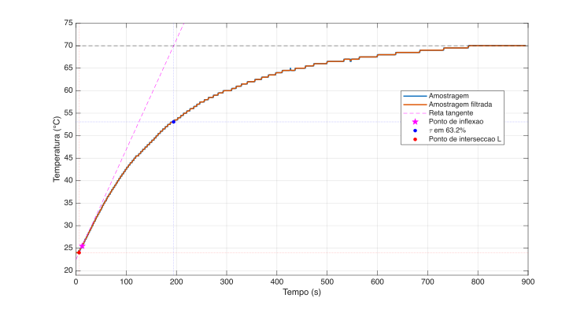
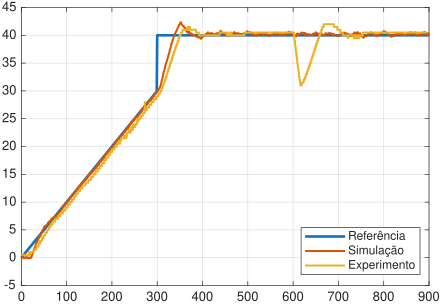

# Identification of the dynamics of a thermal plant and designing a digital Linear Time-Invariant controller for the TeCoLab system

**Gabriel Rodrigues Tavares, Gabriel Tomazzoni Mazzarotto**

This paper presents the identification and digital control of a thermal plant
for the [TeCoLab](https://github.com/ytcsc/TeCoLab) platform. A mathematical
model of the plant was obtained from experimental data and used in the design
of a digital Linear Time-Invariant controller capable of tracking a specified
reference signal. The controller performance was evaluated through simulations
and experimental validation and quantified using the Root Mean Squared Error
performance metric.

### Palavras-chave

digital control, Ziegler--Nichols, PID controller, _feed-forward_, TeCoLab,
thermal plant

## Table of Contents

- [Introduction](#introduction)
- [Plant modeling and identification](#plant-modeling-and-identification)
- [Controller design](#controller-design)
- [Simulation results](#simulation-results)
- [Experimental results](#experimental-results)
- [Comparison between simulation and experimental results](#comparison-between-simulation-and-experimental-results)
- [Analysis of the observed discrepancies](#analysis-of-the-observed-discrepancies)
- [References](#references)
- [Project structure](#project-structure)
  - [Latex files](#latex-files)
  - [Matlab files](#matlab-files)
  - [Python files](#python-files)

## Introduction

The objective of this paper is to identify the dynamics of a thermal plant from
a physical system known as [TeCoLab](https://github.com/ytcsc/TeCoLab) and to
implement a discrete-time Linear Time-Invariant controller with a sampling
period of $15\ \mathrm{s}$. The proposed controller is designed to track a
reference signal with the smallest possible error, taking zero steady-state
error as the ideal performance criterion.

To achieve this objective, plant identification techniques based on sensor
measurements will be employed, including the Ziegler--Nichols step-response
method. In addition, Linear Time-Invariant control strategies, such as
Proportional Integral Derivative control, will be used to obtain the best
possible tracking performance with respect to the reference signal.

The proposed methods will be validated through both simulations and
experimental tests conducted on the [TeCoLab](https://github.com/ytcsc/TeCoLab)
platform.

## Plant modeling and identification

From a step-response test with an input amplitude of $50^\circ\mathrm{C}$
applied to heater 1, the plant dynamics were identified. The feedback signal is
based on sensor 1, while the tracking objective refers to the relative
temperature measured by sensor 2. The Ziegler-Nichols step-response method was
adopted using a First Order Plus Dead Time model as suggests
[Figure 1](#figure-1).

###### Figure 1

**Plant dynamics based on the Ziegler-Nichols approximation for sensor 1.**

Yielding an approximation for each sensor, as given by
[Equation 1](#equation-1) and [Equation 2](#equation-2):

###### Equation 1

$$
G_{1}(s) = \frac{0.92}{188.03s + 1} \cdot e^{-6.37s}
$$

###### Equation 2

$$
G_{2}(s) = \frac{0.91}{183.94s + 1} \cdot e^{-11.66s}
$$

The sensor 1 model, which was used for controller design, was discretized using
Zero-Order Hold with $T_s = 15\ \mathrm{s}$, resulting in
[Equation 7](#equation-7).

The model was evaluated by comparing the step response of the First Order Plus
Dead Time model with the experimental data, showing good agreement in both the
static gain and the identified time constant.

## Controller design

The controller was designed using a parallel Proportional Derivative structure.
The initial gains were obtained using the Ziegler--Nichols tuning method based
on [Equation 1](#equation-1) and were subsequently refined using the Root Mean
Squared Error, defined by [Equation 3](#equation-3), as the performance
criterion.

###### Equation 3

$$
\mathrm{RMSE} = \sqrt{\frac{1}{N}\sum_{k=1}^{N}{\left( r[k] - y[k] \right)}^{2}}
$$

The resulting Proportional Derivative controller is given by
[Equation 4](#equation-4).

###### Equation 4

$$
C_{\mathrm{pd}}(s) = 13.472 + \frac{601.4s}{s+100}
$$

Although the Proportional Derivative controller provided satisfactory dynamic
performance, it still exhibited a noticeable Steady-State Error when tracking
the reference signal.

To reduce this error, a Feed-Forward action was added based on an inverse plant
model combined with a filter that specifies the desired closed-loop dynamics
[[1]](#references), [[2]](#references). This control strategy uses the process
model to anticipate the control action required for reference tracking
[[1]](#references).

In this paper, the Feed-Forward controller was implemented using the inverse
model of the plant described by [Equation 1](#equation-1), operating in
parallel with the Proportional Derivative controller, together with a low-pass
filter to ensure causality. The resulting feed-forward controller is given by
[Equation 5](#equation-5):

###### Equation 5

$$
C_{\mathrm{ff}} = \frac{188.0271s + 1}{6.075 s + 0.92}
$$

[Figure 2](#figure-2) shows the complete control structure. The Feed-Forward
controller acts directly on the reference signal, while the Proportional
Derivative controller compensates for the tracking error through system
feedback.

###### Figure 2

**Proposed control structure composed of a Feed-Forward action applied to the
reference signal and a Proportional Derivative action based on system feedback.**

The controller was discretized using the Tustin method, applied to both the
Proportional Derivative and Feed-Forward controllers. In this method, the
continuous-time operator $s$ is approximated by the bilinear transformation
given in [Equation 6](#equation-6):

###### Equation 6

$$
s \approx \frac{2}{T_s}\frac{z-1}{z+1}
$$

Where $T_s$ is the sampling period, defined as $T_s = 15\ \mathrm{s}$. The plant
model was discretized using Zero-Order Hold, resulting in
[Equation 7](#equation-7).

###### Equation 7

$$
G(z) = z^{-1} \cdot \frac{0.0413z + 0.0293}{z - 0.9233}
$$

## Simulation results

The simulations were made in the Simulink environment using the plant model
identified in [Equation 1](#equation-1) and the controllers presented in
[Equation 4](#equation-4) and [Equation 5](#equation-5). To approximate the
experimental conditions a white noise was added to the plant output, and a
saturation block was included to represent the maximum heater power.

The results demonstrate that the control strategy combining the Proportional
Derivative and Feed-Forward controllers was able to track the reference signal
with low tracking error during both the transient and steady-state regimes.

## Experimental results

The designed controller was implemented in the Python programming language and
deployed on the [TeCoLab](https://github.com/ytcsc/TeCoLab) platform. The
system was subjected to the same reference signal used in the simulations. The
experimental results exhibited behavior consistent with that predicted by the
simulations, maintaining a low tracking error throughout the experiment.

## Comparison between simulation and experimental results

[Figure 3](#figure-3) compares the simulation and experimental results obtained
for the same reference signal. Using the Root Mean Squared Error metric from
[Equation 3](#equation-3) to evaluate the tracking error of the relative
temperature measured by sensor 2.

The simulated system achieved an $\mathrm{RMSE} = 1.5930\,^\circ\mathrm{C}$,
while the experimental test resulted in an
$\mathrm{RMSE} = 2.2956\,^\circ\mathrm{C}$*. In both cases, the combined
Proportional Derivative and Feed-Forward control strategy was able to track the
reference signal during both the ramp transient and steady-state regimes at
$40\,^\circ\mathrm{C}$, recovering from the disturbance introduced at the
10-minute mark.

###### Figure 3

**Comparison between the simulated and experimental results for tracking the
relative temperature reference measured by sensor 2.**

\* In the practical experiment, we obtained a lower than expected performance
    due to an implementation error in the controller, where $\tau = 77$ was used
    instead of $\tau = 188.03$ on Feed-Forward. The $\mathrm{RMSE}$ value was
    calculated based on this erroneous implementation.

## Analysis of the observed discrepancies

The difference between the simulated and experimental Root Mean Squared Error
values was relatively small. The observed discrepancy can be attributed to
factors not considered in the First Order Plus Dead Time model used for the
controller design. The main sources of discrepancy include sensor measurement
noise, transport delays, and unmodeled thermal dynamics of the physical plant.

Another source of discrepancy arises from the system architecture itself, in
which the controller uses the measurement from Sensor 1 for feedback, while the
error is computed based on the temperature measured by Sensor 2.

The disturbance introduced at 10 minutes, resulting from the activation of a
fan, also contributed to the increase in the experimental error, since its
actual effect on the plant differs from the simplified representation adopted
in the simulation.

Despite these discrepancies, the close agreement between the simulated and
experimental Root Mean Squared Error values confirms that the identified model
adequately represents the plant dynamics and that the proposed control strategy
maintains good reference-tracking performance under experimental conditions as
well.

## References

[1] Karl Johan Åström and Richard M. Murray, _Feedback Systems: An Introduction
for Scientists and Engineers_, 2nd ed., Princeton University Press, 
Princeton, 2021.

[2] Dale E. Seborg, Thomas F. Edgar, Duncan A. Mellichamp, and Francis J.
Doyle, _Process Dynamics and Control_, 4th ed., Wiley, Hoboken, NJ, 2016.

---

## Project structure

### Latex files

- `latex/`: contains the paper sources, bibliography, class file, figures, and
  related files.

### Matlab files

- `matlab/`: contains the scripts, Simulink models, datasets, and helper
  packages used for plant identification, controller tuning, and simulation.
- `matlab/0-Ziegler Nichols/`: contains the script used to analyze the
  step-response data and support the Ziegler--Nichols plant identification.
- `matlab/1-Tempo contínuo/`: contains the continuous-time simulation model and
  setup script.
- `matlab/2-Tempo discreto/`: contains the discrete-time simulation files,
  including `tempo_discreto.m` and `simulacao_discreto.slx`, used to evaluate
  the sampled controller implementation.
- `matlab/+zn/`: contains Ziegler--Nichols helper functions for model
  identification and controller calculations.
- `matlab/+rmse/`: contains helper functions for evaluating the Root Mean
  Squared Error criterion.
- `matlab/dataset/`: contains the CSV files with the plant dynamics,
  reference, and experimental response data.

### Python files

- `py/`: contains the Python implementation used in the physical experiment.
  The main file is `py/PID_FF.py`, which implements the Proportional Derivative
  plus Feed-Forward controller deployed on
  [TeCoLab](https://github.com/ytcsc/TeCoLab).
